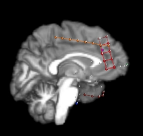

# Brain-computer interfaces (BCI) and neural decoders of  electrocorticographic (ECoG) signals

**Methodology**

Our goal is to create a convolutional neural network decoder that has a similar performance to HTNet(Peterson et al. 2021). We received a dataset from National Institute of Mental Health, Neurology and Neurosurgery – (henceforth OKITI): the study population was 16 patients that were implanted with ECoG to diagnose drug-resistant epilepsy. We used 64 channels for the model training at the minimum, but some subjects have nearly twice that number . However, one patient S09 had some unused channels denoted by x. The electrode configuration consisted of strips and grids (figure 3). We can read them as 1D and 2D arrays. To record the dataset patients were asked to perform specific movements: tapping with their finger, foot, hand, tongue. One patient tapped with both right and left fingers, feet, and hands. Sampling rate was either 1024Hz or 2048Hz. We used two datatypes of u16 and s32. The length of the movements can be determined with timestamps that is also recorded in excel file.

**Figure 1: patient 0: strips and grid**

Our programming language of choice was Python and we set up a Conda virtual environment with all the necessary libraries. The main libraries were TensorFlow and Keras since it would be best to compare with HTNet which also uses the same libraries. Then in the code we read the dataset and preprocess the data to delete channels contaminated with artifacts and EEG channels. We also filter 50 Hz harmonics and restrict data to 0-200 Hz range. After standardizing the data, we create a 2D convolutional neural network that has four convolutional layers and Dense layers (figure 2). After the training on GPU, we evaluate the best model by comparing predicted and test results. To do that we make a confusion matrix and find out the real-world accuracy.

                                

**Figure 2: OKITI model**

We also tried to replicate a study on HTNet which is based on densely connected neural networks that can be applied for transfer learning. We set up a Google Colab environment for that. HTNet is innovative because it will find the overlapping areas of electrodes for the best prediction, and it uses Hilbert transform. The architecture consists of three convolutional layers: 1D temporal convolution as a band-pass filtering, a depthwise convolution as a spatial filter, and a separable convolution as a classifier of temporal features. The author makes use of the Hilbert transform layer after the first convolutional layer to compute spectral power at data-driven frequencies. There are also pooling, dense, and other layers (figure 3).

                                

**Figure 3: neural network model of the first patient in HTNet**

**Results and Discussion**

We received great confusion matrices (figures 4-5) and an accuracy of roughly 90% (figure 6). In particular, the model predicted 100% accurately for four subjects which can be ascribed to overfitting. Nonetheless, this high accuracy is possible because of our small dataset, so the accuracy must be lower on a larger dataset. In addition, there was an error with a third subject which shows that there is a problem with encoding of the data and reading it correctly. We solved it by individual indexing to overcome an error.

**Figure 4: Subject 00 confusion matrix and accuracy**

**Figure 5: Subject 01 confusion matrix and accuracy**

**Figure 6**

The replication of HTNet was not ideal since it takes days to train the model and there is a limit in Google Colab where GPU can be used only for 12 hours continuously. We decided to limit the number of epochs to 2 since the author of HTNet also made graphs with just 2 epochs. It took 3 hours to train, but we were able to only reproduce one graph since we have not used the model for the unseen patients yet (figure 7).

**Figure 7: replicated plot (original on the right)**

We experimented on decoding synchronously recorded ECoG signals in offline mode. The results of this study allowed us to measure the quality of decoding achievable by the developed algorithms and showed the advantage of using deep learning to solve this problem.

The main limitation of the study is a quantity of subjects since there are few patients implanted with ECoG. It is likely that the development of long-term implantation technology over time will increase the amount of data and provide new opportunities for research in this area, but experience with both invasive and noninvasive interfaces suggests that customizing the system for a particular user and working with it will remain individualized.

**Conclusion**

The performance of invasive brain-computer interfaces can be improved using deep learning algorithms since it allows to automatically identify features and model patterns in data at different levels of complexity, and provide additional capabilities, such as extracting information from unlabeled data or applying transfer learning technology.

In the future we will make decoding of ECoG signals in real time and fine-tune HTNet parameters for OKITI dataset for comparison. We will try train with balanced class weights and solve an overfitting problem.
